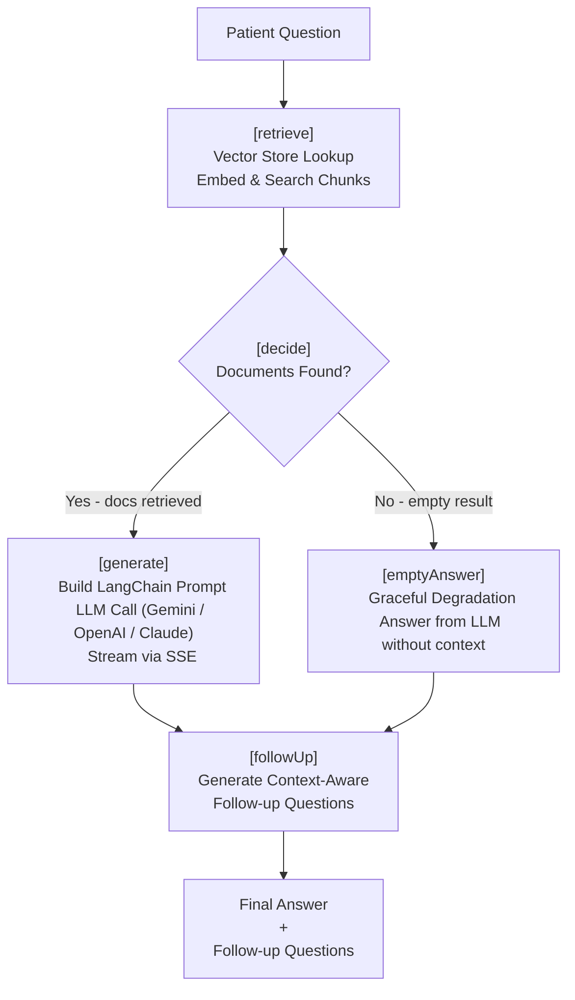
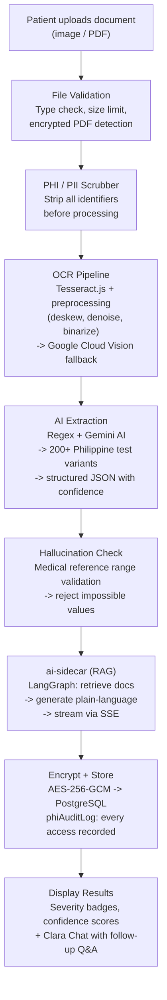

<div align="center"><a name="readme-top"></a>

[![][image-banner]][vercel-link]

<h1>Klaro - Medical AI for the Philippines</h1>

<p>Upload. Analyze. Understand.</p>
<p>Instant plain-language medical document analysis in Filipino, Bisaya, Ilocano, or English.<br/>From lab results to doctor consultations -- all in one HIPAA-compliant platform.</p>

**English** · [Filipino](./README.fil.md) · [Bisaya](./README.ceb.md) · [Ilocano](./README.ilo.md) · [Official Site][official-site] · [Documentation][docs] · [Feedback][github-issues-link]

<!-- SHIELD GROUP -->

[![][github-release-shield]][github-release-link]
[![][docker-release-shield]][docker-release-link]
[![][vercel-shield]][vercel-link]
[![][discord-shield]][discord-link]<br/>
[![][github-action-test-shield]][github-action-test-link]
[![][github-action-coverage-shield]][github-action-coverage-link]
[![][playwright-shield]][playwright-link]
[![][github-releasedate-shield]][github-releasedate-link]<br/>
[![][github-contributors-shield]][github-contributors-link]
[![][github-forks-shield]][github-forks-link]
[![][github-stars-shield]][github-stars-link]
[![][github-issues-shield]][github-issues-link]
[![][github-license-shield]][github-license-link]<br/>

**Share Klaro Repository**

[![][share-x-shield]][share-x-link]
[![][share-telegram-shield]][share-telegram-link]
[![][share-whatsapp-shield]][share-whatsapp-link]
[![][share-reddit-shield]][share-reddit-link]
[![][share-facebook-shield]][share-facebook-link]
[![][share-linkedin-shield]][share-linkedin-link]

<sup>Your AI Health Companion</sup>

</div>

<details>
<summary><kbd>Table of contents</kbd></summary>

#### TOC

- [Getting Started & Join Our Community](#getting-started--join-our-community)
- [What is Klaro?](#what-is-klaro)
- [Features](#features)
  - [Document Analysis & OCR Pipeline](#document-analysis--ocr-pipeline)
  - [AI Extraction & Plain Language Generation](#ai-extraction--plain-language-generation)
  - [AI Sidecar Architecture (LangChain / LangGraph RAG)](#ai-sidecar-architecture-langchain--langgraph-rag)
  - [Clara AI Chatbot](#clara-ai-chatbot)
  - [Healthcare Discovery & Booking](#healthcare-discovery--booking)
  - [Security & Compliance](#security--compliance)
- [Architecture](#architecture)
- [Self Hosting](#self-hosting)
  - [Deploying with Vercel](#deploying-with-vercel)
  - [Deploying with Docker](#deploying-with-docker)
  - [Environment Variables](#environment-variables)
- [Tech Stack](#tech-stack)
- [Local Development](#local-development)
- [Testing](#testing)
- [Ecosystem](#ecosystem)
- [Contributing](#contributing)
- [License](#license)

####

<br/>

</details>

<br/>

<picture>
  <source media="(prefers-color-scheme: dark)" srcset="./public/klaro.gif">
  
</picture>

> 📥 Download the full demo video: [`klaro.mp4`](./public/klaro.mp4) (5.4 MB)

---

## Getting Started & Join Our Community

Klaro makes healthcare accessible by turning complex medical documents into plain language that anyone can understand. Built for the Philippines, it supports local dialects and connects patients with licensed healthcare providers -- all in one app.

**Whether you are:**
- A patient trying to understand your lab results
- A caregiver helping an elderly family member
- Someone in a rural area without easy access to a doctor

**Klaro bridges the gap between medical jargon and real understanding.**

| [![][discord-shield-badge]][discord-link] | Join our Discord community! Connect with developers, clinicians, and users shaping the future of accessible healthcare. |
| :-------------------------------------------------------------------------------------------------------------------------------------------------- | :-------------------------------------------------------------------------------------------------------------------------------------------------------------------- |

> [!IMPORTANT]
>
> **Star us** on GitHub — every star helps more Filipinos discover accessible healthcare 🫶

---

## What is Klaro?

Klaro is an **AI-assisted health companion** that explains medical documents in plain language, supports local dialects, and connects users to nearby care and licensed doctors. The platform processes lab results, prescriptions, and discharge summaries through a multi-stage pipeline -- secure OCR, PHI scrubbing, AI extraction, hallucination validation, and RAG-powered chat -- delivering clear, actionable insights in the patient's preferred language.

**Core mission:** Reduce anxiety, enable understanding, and empower confident action -- regardless of language or medical literacy.

### Multi-Language Support

Speak in your language -- Klaro responds in **Filipino**, **Bisaya** (Cebuano), **Ilocano**, or **English**. All analysis summaries, chat conversations, and UI elements adapt to your chosen dialect. The LLM is prompted to generate responses in the patient's preferred language, with 100+ UI translation keys across all four languages.

---

## Features

### Document Analysis & OCR Pipeline

Upload a lab result, prescription, or discharge summary. Klaro's multi-stage pipeline extracts text, validates it against medical reference ranges, and delivers a clear summary.


- **Multi-format Upload** -- Drag-and-drop PDFs, images (JPG, PNG), or camera photos with multi-file queue support
- **Smart OCR Pipeline** -- Tesseract.js local OCR with image preprocessing (deskew, denoise, binarize, grayscale) and Google Cloud Vision fallback when local confidence is low
- **200+ Philippine Tests** -- Regex-based extraction engine recognizes 200+ local medical test variants (CBC, lipid profile, urinalysis, blood chemistry, etc.)
- **Hallucination Detection** -- Every extracted value checked against medical reference ranges; impossible combinations are flagged and rejected
- **Progress Tracking** -- Upload progress bars, cancellation, retry, and error recovery for every file

---

### AI Extraction & Plain Language Generation

Once OCR extracts raw text, the AI layer translates clinical jargon into readable, actionable guidance.

- **Gemini AI Integration** -- `gemini-2.0-flash` model processes extracted text with structured prompts for medical simplification
- **Confidence Scoring** -- Every extracted value carries a confidence score; low-confidence results trigger reprocessing or fallback
- **Severity Badging** -- Abnormal values are flagged with visual severity indicators (elevated, low, critical)
- **Reference Range Validation** -- Extracted values cross-referenced against a comprehensive medical reference database
- **Audit Trail** -- All AI processing steps logged for compliance and debugging

---

### AI Sidecar Architecture (LangChain / LangGraph RAG)

Klaro's intelligence runs in a dedicated **AI microservice** -- a standalone Express server that encapsulates all LangChain, LangGraph, and vector store logic. This sidecar architecture demonstrates production-grade separation of concerns: the main Next.js application communicates with the AI layer exclusively via HTTP, keeping the AI pipeline independently deployable, testable, and scalable.

**LangGraph Retrieval Graph** (`packages/ai-sidecar/src/retrieval_graph/graph.ts`):

The core RAG pipeline is built as a compiled [LangGraph](https://langchain-ai.github.io/langgraph/) state machine with four nodes and conditional routing:



- **`retrieve`** - Embeds the user question and retrieves relevant document chunks from a vector store (ChromaDB, Supabase pgvector, or mock) with a 5-second timeout and noop fallback for offline stores
- **`decide`** - Conditional edge that routes to `generate` when documents are found, or `emptyAnswer` when the store returns no results (graceful degradation)
- **`generate`** - Constructs a LangChain prompt chain using the retrieved documents as context, calls the configured LLM (Gemini, OpenAI, or Claude), and streams the response via SSE
- **`followUp`** - Generates context-aware follow-up questions to guide the conversation, maintaining multi-turn dialogue coherence

**Key engineering details:**

- **Provider-agnostic model loading** -- `loadChatModel()` in `shared/utils.ts` supports Gemini, OpenAI, and Claude via environment variable, with automatic fallback aliasing
- **Streaming support** -- SSE-based real-time token rendering via `chat-stream.ts` route, with proper backpressure handling
- **Document ingestion pipeline** -- `ingestion_graph/` handles PDF parsing, text chunking, embedding generation, and vector store upsert
- **Graceful degradation** -- Mock mode activates when the LLM is rate-limited or unavailable; the user never hits a dead end
- **Containerized** -- Dockerized with multi-stage build, runs as non-root `sidecar` user, health-checked, and fully configurable via environment variables

**REST API Endpoints (`packages/ai-sidecar/src/routes/`):**

| Endpoint | Method | Purpose |
|----------|--------|---------|
| `/api/health` | GET | Liveness probe for container orchestration |
| `/api/ingest` | POST | Ingest PDFs/images -- parse, chunk, embed, and store in vector DB |
| `/api/chat` | POST | Synchronous chat -- returns complete answer with follow-up questions |
| `/api/chat/stream` | GET | Streaming chat -- SSE-based real-time token response |

---

### Clara AI Chatbot

Meet Clara -- a conversational health assistant who remembers your documents, speaks your language, and answers follow-up questions with full context.

- **Context-Aware** -- Clara reads your scanned documents and understands your health history within a session, maintaining multi-turn conversation state
- **Multilingual** -- Responds naturally in Filipino, Bisaya (Cebuano), Ilocano, or English, with dialect-specific medical terminology
- **Streaming Responses** -- Real-time token rendering via SSE -- no waiting for full responses
- **Safety Guardrails** -- Input filtering, output validation, automatic medical disclaimers, and hallucination detection on every response
- **Graceful Fallback** -- Mock mode activates when the LLM is rate-limited or unavailable
- **PHI-Scrubbed** -- All prompts are stripped of personally identifiable information before reaching the LLM

---

### Healthcare Discovery & Booking

Understanding your results is step one. Klaro connects you with licensed healthcare providers in your area for the next step.

- **Facility Locator** -- Haversine proximity search using Leaflet maps finds clinics and hospitals near your location
- **Doctor Profiles** -- PRC-verified licensed doctors with specializations, ratings, and availability calendars
- **Booking Types** -- Chat consultation, video call, or asynchronous document review
- **Cal.com Integration** -- Schedule appointments via Cal.com with automated reminders
- **Stripe Payments** -- Secure, production-ready payment processing with sandbox mode for testing

---

### Security & Compliance

Medical data demands the highest security standards. Klaro was built from day one with HIPAA-style protections baked into every layer.

| Feature | Implementation |
|---------|----------------|
| PHI/PII Scrubbing | Automatic redaction of names, SSNs, MRNs, phone numbers, addresses, and insurance IDs before any external API call |
| Encryption at Rest | AES-256-GCM for all stored document data using Node.js `crypto` module |
| Audit Logging | `phiAuditLog` -- every access to PHI is recorded with timestamp, user identity, and action type |
| File Retention | Temporary files securely wiped after 24 hours |
| Rate Limiting | Chat: 30 requests/min, Scan: 10 requests/min with exponential backoff and graceful degradation |
| Session Security | IP tracking, expiry validation, automatic timeout after inactivity |
| Encrypted PDF Detection | Detection of password-protected PDFs with user-friendly guidance |
| Corrupt File Handling | Graceful error messages for unreadable or corrupt files |
| Hallucination Detection | AI output validated against medical reference ranges before display |


</div>

---

## Architecture

Klaro is a **pnpm monorepo** managed by **Turborepo**, with three frontends, a type-safe tRPC API layer, and a standalone AI microservice.

```
klaro/                                   -- pnpm monorepo (Turborepo)
|
+-- apps/
|   +-- nextjs/                          -- Web app (Next.js 16 + React 19)
|   |   +-- app/                         -- App Router pages
|   |   +-- components/                  -- React components (CSS Modules, Radix/Shadcn)
|   |   +-- layouts/                     -- Page sections (Hero, Features, Clarity, CTA)
|   |   +-- i18n/                        -- 4-language i18n (en, fil, ceb, ilo)
|   |   +-- e2e/                         -- Playwright E2E tests (10 spec files)
|   +-- expo/                            -- Mobile app (Expo SDK 54 + React Native 0.81)
|   +-- tanstack-start/                  -- Alternative frontend (TanStack Start)
|
+-- packages/
|   +-- api/                             -- tRPC v11 server (routers, services, middleware)
|   |   +-- router/                      -- tRPC procedures (documents, chat, facilities, auth)
|   |   +-- services/                    -- OCR, extraction, PHI scrubber, encryption, hallucination detection
|   |   +-- middleware/                  -- Auth, rate limiting, session validation
|   +-- ai-sidecar/                      -- AI microservice (Express + LangChain/LangGraph RAG)
|   |   +-- src/retrieval_graph/         -- LangGraph state machine (retrieve, generate, followUp)
|   |   +-- src/ingestion_graph/         -- Document ingestion, chunking, embedding pipeline
|   |   +-- src/routes/                  -- REST API (health, ingest, chat, chat/stream)
|   |   +-- src/services/                -- PDF processing, OCR, embeddings, vector store
|   |   +-- src/shared/                  -- Shared utilities (model loading, state, retrieval)
|   +-- db/                              -- Drizzle ORM schema + migrations (PostgreSQL/Neon)
|   +-- auth/                            -- Better Auth (Discord/Google OAuth)
|   +-- validators/                      -- Shared Zod v4 schemas (200+ tests)
|   +-- ui/                              -- Shared components (Shadcn/Radix, Tailwind)
|
+-- tooling/
|   +-- eslint/                          -- ESLint 9 flat configs (base, nextjs, react)
|   +-- prettier/                        -- Prettier 3 with import sorting + Tailwind plugin
|   +-- tailwind/                        -- Tailwind CSS 4 theme + PostCSS config
|   +-- typescript/                      -- Shared TS 5.8 configs (strict mode)
|
+-- docs/                                -- 30+ documentation files (API, deployment, security, testing)
+-- .github/workflows/                   -- CI/CD (lint, typecheck, test, coverage gate, Vercel deploy)
```

### End-to-End Data Flow




---

## Self Hosting

Klaro provides self-hosted deployment via **Vercel** and **Docker**. Deploy your own instance in minutes.

> [!TIP]
>
> Learn more in the [Deployment Guide][docs-deployment].

### Deploying with Vercel

Fork the repository, create a Vercel project from `apps/nextjs`, configure environment variables, and deploy.

| Deploy with Vercel | Deploy with Docker |
| :----------------: | :----------------: |
| [![][deploy-button-image]][deploy-link] | [![][docker-release-shield]][docker-release-link] |

#### Keep Updated

After forking, enable the upstream sync action. See [Auto Sync With Latest][docs-upstream-sync] for instructions.

<br/>

### Deploying with Docker

The AI sidecar and vector database run as Docker containers with a single command:

```bash
cd packages/ai-sidecar
cp .env.example .env
# Edit .env with your LLM API keys and configuration
docker compose up -d
```

This starts:
- **ai-sidecar** -- LangChain/LangGraph RAG microservice on port `3002`
- **chromadb** -- Chroma vector database on port `8000` with persistent volume

> [!NOTE]
>
> See the [Docker Deployment Guide][docs-docker] for detailed instructions.

<br/>

### Environment Variables

| Variable | Required | Description |
|----------|----------|-------------|
| `POSTGRES_URL` | Yes | PostgreSQL/Neon connection string |
| `AUTH_SECRET` | Yes | Better Auth secret (generate: `openssl rand -base64 32`) |
| `AUTH_DISCORD_ID` / `AUTH_DISCORD_SECRET` | Yes | Discord OAuth credentials |
| `AUTH_GOOGLE_ID` / `AUTH_GOOGLE_SECRET` | No | Google OAuth credentials |
| `LLM_API_KEY` | Yes | API key for your LLM provider (Gemini, OpenAI, or Claude) |
| `LLM_PROVIDER` | Yes | `gemini`, `openai`, or `claude` |
| `GEMINI_API_KEY` | Yes* | Google Gemini API key (required if provider is `gemini`) |
| `GEMINI_MODEL` | No | Default: `gemini-2.0-flash` |
| `CLOUDINARY_CLOUD_NAME` / `API_KEY` / `API_SECRET` | Yes | Cloudinary credentials for file storage |
| `NEXT_PUBLIC_APP_URL` | Yes | Public app URL (e.g. `https://klaro-scans.tech`) |
| `GOOGLE_VISION_API_KEY` | No | Cloud Vision API key (OCR fallback) |
| `OCR_CONFIDENCE_THRESHOLD` | No | Minimum OCR confidence (default: `0.7`) |
| `ENABLE_MOCK_MODE` | No | `true` to use mock AI responses (no API keys needed) |

> [!NOTE]
>
> Complete environment variable reference in the [Environment Variables Guide][docs-env-var].

[![][back-to-top]](#readme-top)

---

## Tech Stack

| Category | Technology |
|----------|------------|
| **Framework** | Next.js 16 (React 19) |
| **Mobile** | Expo SDK 54 (React Native 0.81) |
| **Language** | TypeScript 5.8 (strict mode) |
| **Package Manager** | pnpm 10 (workspaces, catalog) |
| **Build System** | Turborepo |
| **API Layer** | tRPC v11 (type-safe RPC with superjson) |
| **Auth** | Better Auth (Discord/Google OAuth) |
| **Database** | PostgreSQL via Neon (serverless) |
| **ORM** | Drizzle ORM |
| **Validation** | Zod v4 |
| **AI - Extraction** | Google Gemini (`gemini-2.0-flash`) + Tesseract.js OCR |
| **AI - RAG/Chat** | LangChain + LangGraph (standalone Express microservice) |
| **AI - Vision** | Google Cloud Vision API (OCR fallback) |
| **Vector Store** | ChromaDB / Supabase pgvector / mock (configurable) |
| **Embeddings** | Provider-agnostic embedding model via LangChain |
| **Styling** | Tailwind CSS 4, NativeWind, CSS Modules |
| **UI Components** | Radix UI / Shadcn, sonner, lucide-react |
| **Animations** | Framer Motion 12, Lenis (smooth scroll) |
| **File Storage** | Cloudinary |
| **Payments** | Stripe (sandbox) |
| **Maps** | Leaflet + react-leaflet (Haversine proximity search) |
| **Testing** | Vitest (80% coverage gate), Playwright |
| **Encryption** | AES-256-GCM (Node.js crypto) |
| **Containerization** | Docker + docker-compose (ChromaDB + sidecar) |
| **CI/CD** | GitHub Actions (+ Renovate for dependency updates) |
| **Deployment** | Vercel (web), Docker (ai-sidecar) |

[![][back-to-top]](#readme-top)

---

## Local Development

```bash
# Clone the repository
git clone https://github.com/PP-Namias/klaro.git
cd klaro

# Install dependencies
pnpm install

# Set up environment variables
cp .env.example .env
# Edit .env with your database URL, auth secrets, and API keys

# Generate auth schema
pnpm auth:generate

# Push database schema to PostgreSQL
pnpm db:push

# Start all services (web app + API)
pnpm dev
```

Open [http://localhost:3000](http://localhost:3000) for the web app.

### AI Sidecar

For the full RAG-powered experience:

```bash
cd packages/ai-sidecar
cp .env.example .env
# Edit .env with your LLM API keys
pnpm dev              # Starts on port 3002
```

Or with Docker (includes ChromaDB):

```bash
cd packages/ai-sidecar
docker compose up
```

### Mobile App

```bash
cd apps/expo
pnpm dev
```

See the [Mobile Development Guide][docs-mobile] for device setup.

[![][back-to-top]](#readme-top)

---

## Testing

Klaro enforces an **80% coverage gate** across the monorepo with **834+ unit tests** and **10 Playwright E2E specs**.

### Unit Tests (Vitest)

```bash
# Run all tests
pnpm test

# With coverage report
pnpm test:coverage

# Watch mode
pnpm test:watch

# Specific package
pnpm --filter @klaro/api test
pnpm --filter @klaro/db test
```

### E2E Tests (Playwright)

```bash
# Start the dev server first
pnpm dev

# In another terminal, run Playwright
cd apps/nextjs
pnpm exec playwright test

# Interactive UI mode
pnpm exec playwright test --ui

# Single spec file
pnpm exec playwright test e2e/upload-flow.spec.ts
```

### Test Coverage Summary

| Module | Tests | What is Covered |
|--------|-------|-----------------|
| `packages/validators` | 200+ | Zod schema validation for all API inputs |
| `packages/db` | 126+ | Schema definitions, enums, seed data |
| `packages/auth` | 15+ | Auth initialization, OAuth configuration |
| `packages/api` | 300+ | tRPC routers, OCR, extraction, PHI scrubber, encryption, hallucination detection, rate limiter |
| `apps/nextjs` | 115+ | Route handlers, i18n translations, component rendering |
| `apps/expo` | 13 | Mobile component rendering |
| `apps/nextjs/e2e/` | 10 specs | Playwright E2E (upload, chat, booking, analysis, error states, full journey) |

> [!NOTE]
>
> CI blocks merges below 80% branch coverage. See the [Testing Guide][docs-testing] for details.

[![][back-to-top]](#readme-top)

---

## Ecosystem

| Package | Path | Description |
|---------|------|-------------|
| `@klaro/nextjs` | `apps/nextjs/` | Web application -- Next.js 16 App Router |
| `@klaro/expo` | `apps/expo/` | Mobile application -- Expo SDK 54 (React Native) |
| `@klaro/tanstack-start` | `apps/tanstack-start/` | Alternative frontend -- TanStack Start |
| `@klaro/api` | `packages/api/` | tRPC API server -- all backend routers, services, and middleware |
| `@klaro/ai-sidecar` | `packages/ai-sidecar/` | AI microservice -- LangChain/LangGraph RAG pipeline (Express) |
| `@klaro/db` | `packages/db/` | Database schema, client, and Drizzle ORM migrations |
| `@klaro/auth` | `packages/auth/` | Authentication -- Better Auth with Discord/Google OAuth |
| `@klaro/validators` | `packages/validators/` | Shared Zod schemas and TypeScript types |
| `@klaro/ui` | `packages/ui/` | Shared UI components (Shadcn/Radix, Tailwind CSS) |
| `@klaro/eslint-config` | `tooling/eslint/` | ESLint 9 flat configuration |
| `@klaro/prettier-config` | `tooling/prettier/` | Prettier 3 with import sorting and Tailwind plugin |
| `@klaro/tailwind-config` | `tooling/tailwind/` | Tailwind CSS 4 theme and PostCSS configuration |
| `@klaro/tsconfig` | `tooling/typescript/` | TypeScript 5.8 strict mode configuration |

[![][back-to-top]](#readme-top)

---

## Contributing

Contributions of all types are welcome. Whether fixing a typo, adding a translation, or building a new feature -- your help makes healthcare more accessible for millions of Filipinos.

> [!TIP]
>
> **Principal Maintainer:** [@PP-Namias](https://github.com/PP-Namias)

[![][pr-welcome-shield]][pr-welcome-link]
[![][submit-translation-shield]][submit-translation-link]
[![][submit-issue-shield]][submit-issue-link]

### Workflow

1. **Fork** the repository
2. **Create a feature branch** (`git checkout -b feature/amazing-feature`)
3. **Commit your changes** using conventional commits:
   - `feat:` -- new feature
   - `fix:` -- bug fix
   - `test:` -- adding or updating tests
   - `docs:` -- documentation changes
   - `refactor:` -- code refactoring
   - `chore:` -- maintenance tasks
4. **Verify tests pass** (`pnpm test`)
5. **Push** to your fork (`git push origin feature/amazing-feature`)
6. **Open a Pull Request**

### Areas Needing Help

- **Translations** -- Add or improve Filipino, Bisaya, or Ilocano UI strings in `apps/nextjs/src/i18n/`
- **Test Coverage** -- Help push past the 80% gate; every test counts
- **Documentation** -- Improve guides, add examples, fix typos in `docs/`
- **Healthcare Data** -- Contribute anonymized test cases for Philippine medical tests
- **UI/UX** -- Design improvements, accessibility fixes, mobile responsiveness

<a href="https://github.com/PP-Namias/klaro/graphs/contributors" target="_blank">
  <table>
    <tr>
      <th colspan="2">
        <br><br><br>
      </th>
    </tr>
    <tr>
      <td>
        <picture>
          <source media="(prefers-color-scheme: dark)" srcset="https://next.ossinsight.io/widgets/official/compose-org-active-contributors/thumbnail.png?activity=active&period=past_28_days&owner_id=PP-Namias&repo_ids=klaro&image_size=2x3&color_scheme=dark">
          
        </picture>
      </td>
      <td rowspan="2">
        <picture>
          <source media="(prefers-color-scheme: dark)" srcset="https://next.ossinsight.io/widgets/official/compose-org-participants-growth/thumbnail.png?activity=active&period=past_28_days&owner_id=PP-Namias&repo_ids=klaro&image_size=4x7&color_scheme=dark">
          
        </picture>
      </td>
    </tr>
    <tr>
      <td>
        <picture>
          <source media="(prefers-color-scheme: dark)" srcset="https://next.ossinsight.io/widgets/official/compose-org-active-contributors/thumbnail.png?activity=new&period=past_28_days&owner_id=PP-Namias&repo_ids=klaro&image_size=2x3&color_scheme=dark">
          
        </picture>
      </td>
    </tr>
  </table>
</a>

Please review [CONTRIBUTING.md](./CONTRIBUTING.md) for our full contribution guidelines and code of conduct.

[![][back-to-top]](#readme-top)

---

## License

Copyright (c) 2026 [Jhon Keneth Namias][profile-link]. <br />
This project is [MIT](./LICENSE) licensed.

[![][back-to-top]](#readme-top)

---

<!-- LINK GROUP -->

[back-to-top]: https://img.shields.io/badge/-BACK_TO_TOP-151515?style=flat-square
[official-site]: https://www.klaro-scans.tech
[docs]: ./docs/README.md
[docs-deployment]: ./docs/DEPLOYMENT_GUIDE.md
[docs-docker]: ./docs/DEPLOYMENT_GUIDE.md#docker-deployment
[docs-upstream-sync]: ./docs/DEPLOYMENT_GUIDE.md#keeping-your-fork-synced
[docs-env-var]: ./docs/ENV_CONFIG.md
[docs-mobile]: ./docs/MOBILE_DEV_GUIDE.md
[docs-testing]: ./docs/TESTING_GUIDE.md

[vercel-link]: https://www.klaro-scans.tech
[discord-link]: https://discord.gg/krnGXBmp3h

[github-release-link]: https://github.com/PP-Namias/klaro/releases
[github-release-shield]: https://img.shields.io/github/v/release/PP-Namias/klaro?color=369eff&labelColor=black&logo=github&style=flat-square
[github-action-test-link]: https://github.com/PP-Namias/klaro/actions/workflows/ci.yml
[github-action-test-shield]: https://img.shields.io/github/actions/workflow/status/PP-Namias/klaro/ci.yml?label=build&labelColor=black&logo=githubactions&logoColor=white&style=flat-square
[github-action-coverage-link]: https://github.com/PP-Namias/klaro/actions/workflows/coverage.yml
[github-action-coverage-shield]: https://img.shields.io/github/actions/workflow/status/PP-Namias/klaro/coverage.yml?label=coverage&labelColor=black&logo=vitest&logoColor=white&style=flat-square
[github-releasedate-link]: https://github.com/PP-Namias/klaro/releases
[github-releasedate-shield]: https://img.shields.io/github/release-date/PP-Namias/klaro?labelColor=black&style=flat-square
[github-contributors-link]: https://github.com/PP-Namias/klaro/graphs/contributors
[github-contributors-shield]: https://img.shields.io/github/contributors/PP-Namias/klaro?color=c4f042&labelColor=black&style=flat-square
[github-forks-link]: https://github.com/PP-Namias/klaro/network/members
[github-forks-shield]: https://img.shields.io/github/forks/PP-Namias/klaro?color=8ae8ff&labelColor=black&style=flat-square
[github-stars-link]: https://github.com/PP-Namias/klaro/stargazers
[github-stars-shield]: https://img.shields.io/github/stars/PP-Namias/klaro?color=ffcb47&labelColor=black&style=flat-square
[github-issues-link]: https://github.com/PP-Namias/klaro/issues
[github-issues-shield]: https://img.shields.io/github/issues/PP-Namias/klaro?color=ff80eb&labelColor=black&style=flat-square
[github-license-link]: https://github.com/PP-Namias/klaro/blob/main/LICENSE
[github-license-shield]: https://img.shields.io/badge/license-MIT-white?labelColor=black&style=flat-square

[docker-release-link]: https://hub.docker.com/r/ppnamias/klaro
[docker-release-shield]: https://img.shields.io/badge/docker-pending-369eff?labelColor=black&logo=docker&logoColor=white&style=flat-square

[vercel-shield]: https://img.shields.io/badge/vercel-deployed-55b467?labelColor=black&logo=vercel&style=flat-square
[playwright-link]: https://playwright.dev
[playwright-shield]: https://img.shields.io/badge/Playwright-E2E-45ba4b?labelColor=black&logo=playwright&logoColor=white&style=flat-square

[discord-shield]: https://img.shields.io/badge/discord-join-5865F2?labelColor=black&logo=discord&logoColor=white&style=flat-square
[discord-shield-badge]: https://img.shields.io/badge/discord-join_us-5865F2?labelColor=black&logo=discord&logoColor=white&style=for-the-badge

[deploy-button-image]: https://vercel.com/button
[deploy-link]: https://vercel.com/new/clone?repository-url=https%3A%2F%2Fgithub.com%2FPP-Namias%2Fklaro&env=POSTGRES_URL,AUTH_SECRET,LLM_API_KEY,CLOUDINARY_CLOUD_NAME,CLOUDINARY_API_KEY,CLOUDINARY_API_SECRET&project-name=klaro&repository-name=klaro

[image-banner]: ./apps/nextjs/public/Klaro.png

[profile-link]: https://github.com/PP-Namias

[pr-welcome-link]: https://github.com/PP-Namias/klaro/pulls
[pr-welcome-shield]: https://img.shields.io/badge/PR_welcome-%E2%86%92-ffcb47?labelColor=black&style=for-the-badge
[submit-translation-link]: https://github.com/PP-Namias/klaro/issues/new?template=translation.yml
[submit-translation-shield]: https://img.shields.io/badge/submit_translation-%E2%86%92-95f3d9?labelColor=black&style=for-the-badge
[submit-issue-link]: https://github.com/PP-Namias/klaro/issues/new/choose
[submit-issue-shield]: https://img.shields.io/badge/report_issue-%E2%86%92-ff80eb?labelColor=black&style=for-the-badge

[share-x-link]: https://x.com/intent/tweet?hashtags=medicalAI,healthtech,opensource&text=Klaro%20-%20Medical%20AI%20for%20the%20Philippines.%20Upload%20lab%20results%2C%20get%20plain-language%20explanations%20in%20Filipino%2C%20Bisaya%2C%20or%20Ilocano.&url=https%3A%2F%2Fgithub.com%2FPP-Namias%2Fklaro
[share-x-shield]: https://img.shields.io/badge/-share%20on%20x-black?labelColor=black&logo=x&logoColor=white&style=flat-square
[share-telegram-link]: https://t.me/share/url?text=Klaro%20-%20Medical%20AI%20for%20the%20Philippines.%20Understand%20your%20lab%20results%20in%20plain%20language.&url=https%3A%2F%2Fgithub.com%2FPP-Namias%2Fklaro
[share-telegram-shield]: https://img.shields.io/badge/-share%20on%20telegram-black?labelColor=black&logo=telegram&logoColor=white&style=flat-square
[share-whatsapp-link]: https://api.whatsapp.com/send?text=Klaro%20-%20Medical%20AI%20for%20the%20Philippines%20-%20https%3A%2F%2Fgithub.com%2FPP-Namias%2Fklaro
[share-whatsapp-shield]: https://img.shields.io/badge/-share%20on%20whatsapp-black?labelColor=black&logo=whatsapp&logoColor=white&style=flat-square
[share-reddit-link]: https://www.reddit.com/submit?title=Klaro%20-%20Medical%20AI%20for%20the%20Philippines&url=https%3A%2F%2Fgithub.com%2FPP-Namias%2Fklaro
[share-reddit-shield]: https://img.shields.io/badge/-share%20on%20reddit-black?labelColor=black&logo=reddit&logoColor=white&style=flat-square
[share-facebook-link]: https://facebook.com/sharer/sharer.php?u=https%3A%2F%2Fgithub.com%2FPP-Namias%2Fklaro
[share-facebook-shield]: https://img.shields.io/badge/-share%20on%20facebook-black?labelColor=black&logo=facebook&logoColor=white&style=flat-square
[share-linkedin-link]: https://linkedin.com/sharing/share-offsite/?url=https%3A%2F%2Fgithub.com%2FPP-Namias%2Fklaro
[share-linkedin-shield]: https://img.shields.io/badge/-share%20on%20linkedin-black?labelColor=black&logo=linkedin&logoColor=white&style=flat-square
