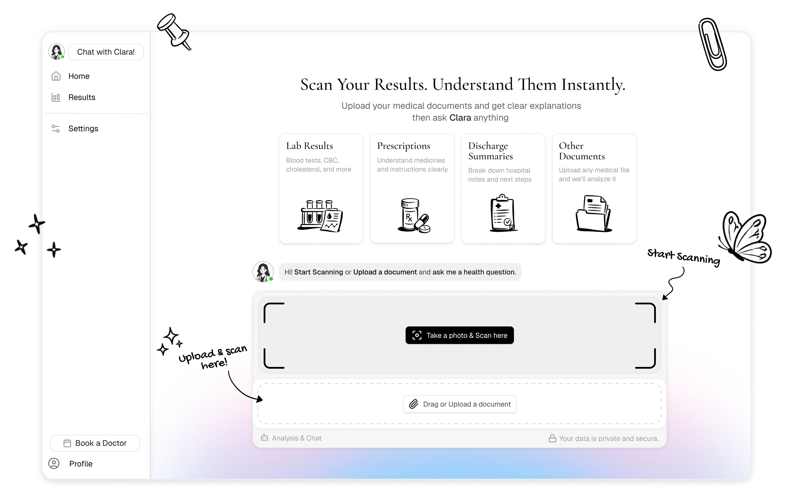
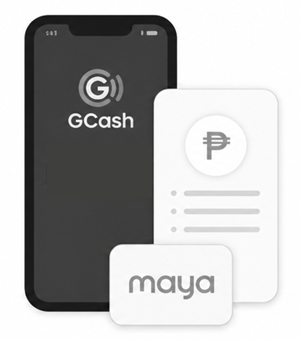
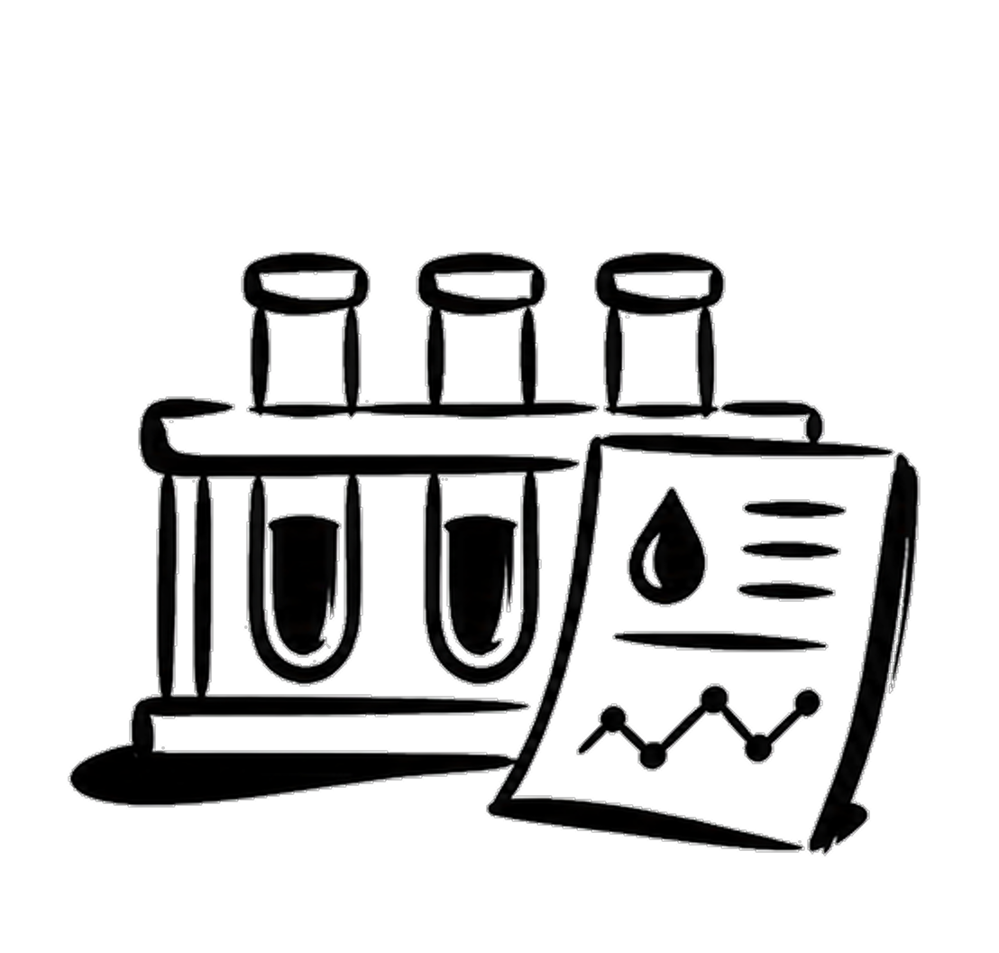
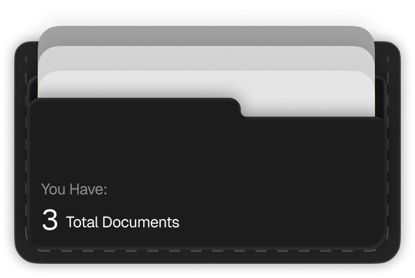

<div align="center">

#  Klaro

### Instant plain-language medical document understanding for the Philippines

[](https://github.com/PP-Namias/klaro)
[](https://github.com/PP-Namias/klaro)
[](./LICENSE)
[](https://www.klaro-scans.tech/)
[](https://www.typescriptlang.org/)
[](https://pnpm.io/)

<br>

**[Try Live Demo](https://www.klaro-scans.tech/)** · **[Report Bug](https://github.com/PP-Namias/klaro/issues)** · **[Request Feature](https://github.com/PP-Namias/klaro/issues)**

</div>

---

<div align="center">



</div>

---

## The Problem

> **70% of Filipino patients cannot understand their own medical documents.**

When a Filipino patient receives lab results, prescriptions, or discharge summaries, they're often overwhelmed with medical jargon they don't understand. This leads to:

- **Anxiety and confusion** — Patients misinterpret their results
- **Language barriers** — Medical terms aren't explained in local dialects
- **Missed follow-ups** — Patients don't know when or where to seek care
- **Healthcare inequality** — Rural communities lack access to medical guidance

**Klaro solves this by making medical documents understandable for everyone.**

---

## Our Solution

<div align="center">

| | | | |
|:---:|:---:|:---:|:---:|
| **Scan** | **Chat** | **Find** | **Book** |
| Upload medical docs, get instant plain-language explanations | Ask Clara AI follow-up questions in your dialect | Discover nearby clinics and hospitals | Schedule free consultations with licensed doctors |

</div>

---

## Demo

<div align="center">

### [Try Klaro Live →](https://www.klaro-scans.tech/)

</div>

<br>

<div align="center">


**Document Scan & AI Analysis**

Upload lab results, prescriptions, or discharge summaries — Klaro explains everything in plain language.

</div>

<br>

<div align="center">


**Clara AI Chatbot**

Ask follow-up questions about your medical documents in Filipino, Bisaya, Ilocano, or English.

</div>

<br>

<div align="center">



**Healthcare Facility Discovery**

Find nearby clinics and hospitals with PhilHealth accreditation status and real-time availability.

</div>

---

## Built at DevKada Hackathon

**Klaro** was built in a **5-day sprint** as part of the **DevKada Hackathon**.

| Day | Milestone |
|:---:|:---|
| **Day 1** | Monorepo setup, authentication, database schema, core architecture |
| **Day 2** | OCR pipeline, document upload, Gemini AI integration |
| **Day 3** | Plain language engine, severity scoring, Filipino dialect support |
| **Day 4** | Clara AI chatbot, context-aware conversations, safety filtering |
| **Day 5** | Healthcare facilities, doctor booking, final polish |

> *"We wanted to build something that our grandparents could actually use."*

---

## Key Features

<div align="center">

   

</div>

<br>

### Document Scan & AI Analysis

Upload lab results, prescriptions, or discharge summaries — Klaro extracts and explains everything in plain language.

- **Multiple upload methods**: Photo, document scanner, or PDF
- **Smart extraction**: Powered by Gemini AI for accurate data parsing
- **Severity scoring**: Automatic flagging of critical values
- **Tanong Mo Sa Doktor**: Generated talking points for doctor consultations

### Clara AI Chatbot


Ask follow-up questions about your medical documents in your preferred dialect.

- **Context-aware**: Remembers your scanned documents
- **Multilingual**: Filipino, Bisaya, Ilocano, English
- **Safety-first**: Built-in content filtering for medical advice
- **Language adaptation**: Responds in your preferred dialect

<br clear="right">

### Healthcare Facility Discovery

Find nearby clinics and hospitals with real-time information.

- **Geolocation-based search**: Find facilities near you
- **PhilHealth accreditation status**: Filter by insurance compatibility
- **Operating hours**: Real-time availability info
- **Integrated data**: DOH database + Google Maps

### Free Doctor Consultations

Connect with licensed Filipino healthcare providers at no cost.

- **Multiple formats**: Chat, video, or document review
- **Automatic document sharing**: Your scans go directly to the doctor
- **PRC verified**: All providers are licensed professionals
- **Digital prescriptions**: Get prescriptions and referrals instantly

---

## Tech Stack

<div align="center">

### Frontend


### Backend


### AI & OCR


### DevOps & Tools


</div>

---

## Architecture

```
klaro/
├── apps/
│   ├── nextjs/              # Web application (Next.js 15)
│   └── expo/                # Mobile app (iOS & Android)
├── packages/
│   ├── api/                 # tRPC routers + services (283 tests)
│   │   └── src/
│   │       ├── services/    # Business logic (AI, OCR, chat)
│   │       ├── router/      # API endpoints
│   │       └── utils/       # Shared utilities
│   ├── auth/                # Authentication (Better Auth)
│   ├── db/                  # Database schema (Drizzle ORM)
│   ├── validators/          # Shared Zod schemas
│   └── ui/                  # Shared component library
└── docs/                    # Documentation
```

---

## Getting Started

### Prerequisites

- **Node.js** 22 or later
- **pnpm** 10 or later
- **PostgreSQL** database

### Installation

```bash
# Clone the repository
git clone https://github.com/PP-Namias/klaro.git
cd klaro

# Install dependencies
pnpm install

# Set up environment
cp .env.example .env
# Edit .env with your configuration

# Generate auth schema
pnpm auth:generate

# Push database schema
pnpm db:push

# Start development
pnpm dev
```

The app will be available at:
- **Web**: http://localhost:3000
- **API**: http://localhost:3000/api

---

## Testing

Klaro has **283 unit tests** across 19 test files, built using TDD (Test-Driven Development).

```bash
# Run all API tests
cd packages/api
npx vitest run

# Run specific test file
npx vitest run src/services/__tests__/geminiExtraction.test.ts

# Watch mode
npx vitest
```

### Test Coverage

| Module | Tests | Description |
|:---|:---:|:---|
| **Upload** | 56 | File validation, document service, progress tracking |
| **OCR** | 85 | Preprocessing, cloud fallback, result normalization |
| **Gemini AI** | 55 | Extraction, prompts, fallback handling, pipeline |
| **Plain Language** | 60 | Terminology, severity scoring, Tanong Mo Sa Doktor |
| **Clara Chat** | 27 | Chat service, context assembly, dialect detection |

---

## Project Structure

<details>
<summary><strong>packages/api/src/services/</strong> (click to expand)</summary>

```
services/
├── __tests__/              # Unit tests (283 tests)
├── chatHistory.ts          # Chat history management
├── chatSafety.ts           # Content filtering & safety
├── claraChat.ts            # Clara AI chatbot service
├── contextAssembler.ts     # Document context for LLM
├── dialectDetection.ts     # Filipino dialect detection
├── documentService.ts      # Document CRUD operations
├── enhancedOcr.ts          # Image preprocessing
├── geminiExtraction.ts     # Data extraction utilities
├── geminiFallback.ts       # Fallback handling
├── geminiPipeline.ts       # End-to-end extraction
├── geminiPrompts.ts        # Medical analysis prompts
├── geminiVision.ts         # Vision API client
├── medicalTerminology.ts   # 21 medical term codes
├── ocr.ts                  # OCR service
├── ocrResult.ts            # Result normalization
├── plainLanguage.ts        # Plain language generation
├── severityScoring.ts      # Lab result severity
├── tanongMoCard.ts         # Doctor question cards
├── analysisStorage.ts      # Analysis record storage
└── uploadProgress.ts       # Upload tracking
```

</details>

---

## Documentation

Comprehensive documentation is available in the [`docs/`](./docs/) directory:

| Document | Description |
|:---|:---|
| [API Reference](./docs/API_REFERENCE.md) | API endpoint documentation |
| [Backend Guide](./docs/BACKEND_DEV_GUIDE.md) | Backend development guidelines |
| [Mobile Guide](./docs/MOBILE_DEV_GUIDE.md) | Mobile application development |
| [Web Guide](./docs/WEB_DEV_GUIDE.md) | Web application development |
| [Database Guide](./docs/DATABASE_GUIDE.md) | Database schema and ORM usage |
| [Security Guide](./docs/SECURITY_GUIDE.md) | Security best practices |
| [Deployment](./docs/DEPLOYMENT_GUIDE.md) | Production deployment steps |

---

## Contributors

Built with <3 by:

<div align="center">

<a href="https://github.com/PP-Namias">
  
</a>
<a href="https://github.com/aikhe">
  
</a>
<a href="https://github.com/frtzhahn">
  
</a>

| | Name | GitHub |
|:---:|:---|:---|
|  | **Jhon Keneth Namias** | [@PP-Namias](https://github.com/PP-Namias) |
|  | **aikhe** | [@aikhe](https://github.com/aikhe) |
|  | **aldrin** | [@frtzhahn](https://github.com/frtzhahn) |

</div>

---

## Acknowledgments

- **[Gemini AI](https://ai.google.dev/)** — Powers document extraction and analysis
- **[Tesseract.js](https://tesseract.projectnaptha.com/)** — OCR text extraction
- **[tRPC](https://trpc.io/)** — End-to-end type-safe APIs
- **[Better Auth](https://www.better-auth.com/)** — Authentication system
- **[Drizzle ORM](https://orm.drizzle.team/)** — Database toolkit
- **[Shields.io](https://shields.io/)** — Badge generation

---

## License

This project is licensed under the **MIT License** — see the [LICENSE](./LICENSE) file for details.

---

<div align="center">

**Built for Filipino healthcare** · **DevKada Hackathon 2026**

[](https://www.klaro-scans.tech/)

</div>
